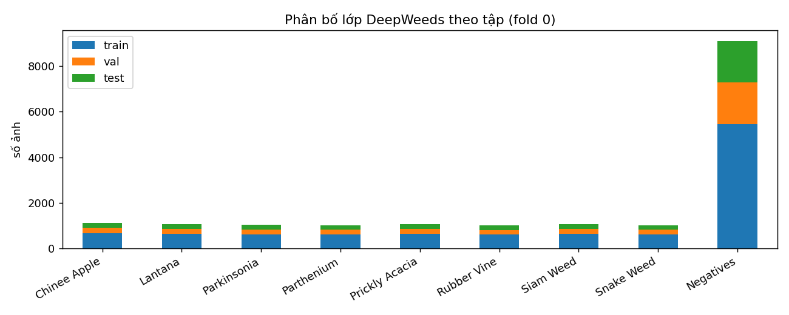
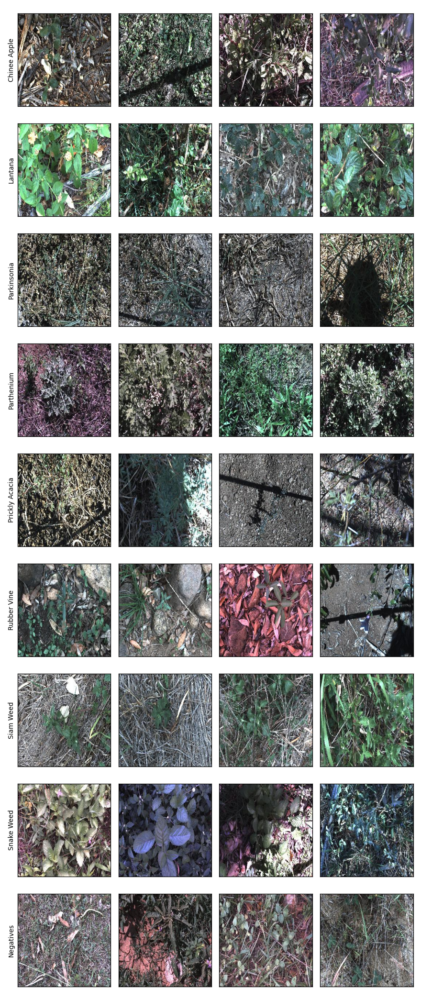
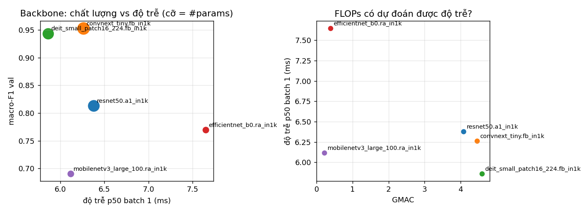
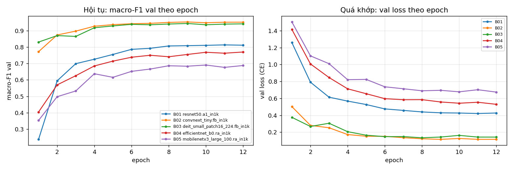
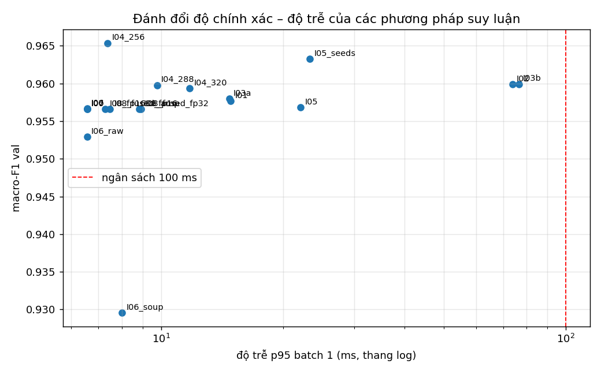
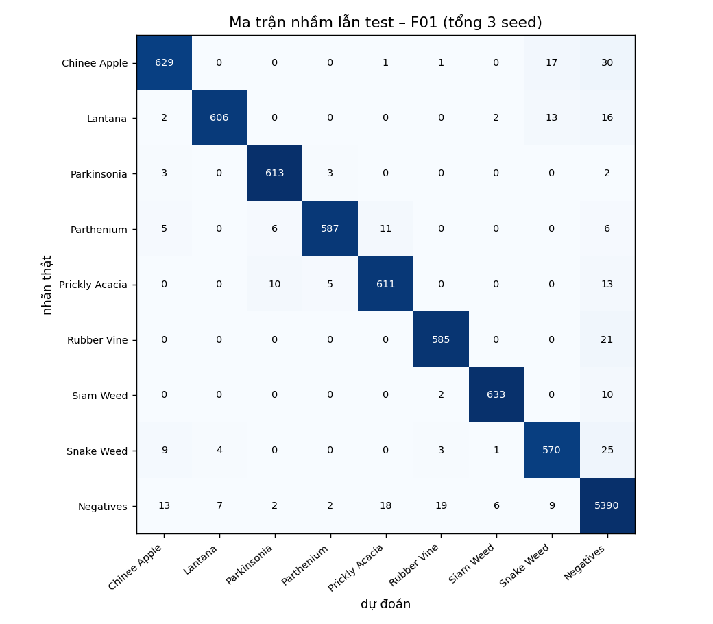
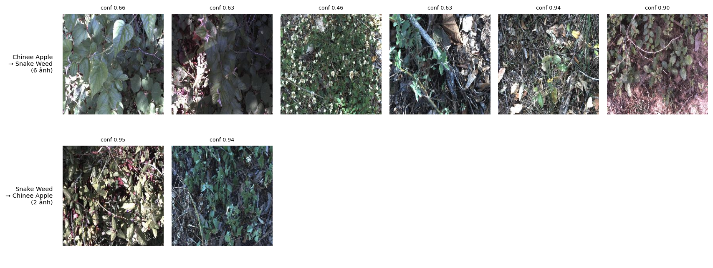
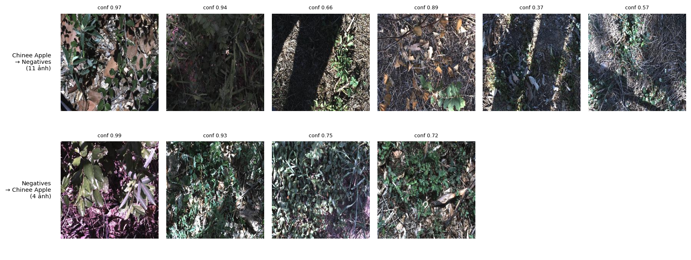

# Báo cáo Lab Day 2 — DeepWeeds · Nguyễn Văn Quốc Việt · 2A202602973

> Mọi bảng lấy từ `results.xlsx` / output của `eval.py` (lần chạy Kaggle, log ở `kaggle_run_log.txt`); mọi lựa chọn
> cấu hình theo quy tắc trên val ghi ở đầu `code/experiments.py`. Kết quả quét sàng (Bước 1–3) là 1 seed; chỉ kết luận
> "tốt hơn" khi chênh lệch vượt ngưỡng nhiễu đo được.
> Kiểm tra khớp số (Final/PerClass so với `eval.py score`): KHỚP

## 1. Tóm tắt
- Cấu hình tốt nhất F01: backbone `convnext_tiny.fb_in1k` + công thức `T10` + suy luận `I04_256` + temperature scaling.
- Test (mean ± std (3 seed)): macro-F1 **0.9632 ± 0.0006**, top-1 **0.9718 ± 0.0000**, ECE 0.0057 ± 0.0001.
- Mốc T00 + I00: macro-F1 0.9522 ± 0.0026, top-1 0.9625 ± 0.0014.
- Bài toán: phân loại 9 lớp DeepWeeds (fold 0), chỉ số chính macro-F1. Đã chạy 5 backbone, 9 ablation trên 5 trục
  (A, B, C, D, F) + 1 kết hợp, 18 cấu hình suy luận, và chung kết 3 seed so với mốc 3 seed.
- Chung kết tốt hơn mốc rõ rệt: Δ macro-F1 test = +0,0109, lớn hơn khoảng 4 lần std lớn hơn của hai nhóm (0,0026).
- Yếu tố lớn nhất là backbone (cùng công thức nền: ConvNeXt-T 0,953, DeiT-S 0,944, ba mạng dùng BatchNorm 0,69–0,81
  macro-F1 val). Phần tăng ở chung kết đến chủ yếu từ suy luận ở độ phân giải 256 (F01 0,9632 so với cùng mô hình
  1 view F01rt 0,9517); công thức T10 không tạo khác biệt đo được trên test (F01rt 0,9517 ± 0,0058 so với mốc 0,9522 ± 0,0026).
- Temperature scaling giảm ECE test từ 0,092 xuống 0,006 mà không đổi accuracy. Cấu hình cuối chỉ cần một lượt chạy:
  p95 khoảng 7,4 ms ở batch 1 trên T4, dư nhiều so với ngân sách 100 ms.

## 2. Dữ liệu và thiết lập
- DeepWeeds, fold 0 chia sẵn (train_subset0 / val_subset0 / test_subset0), không sửa, không lọc, không chia lại.
- Số ảnh: train 10501, val 3501, test 3507 (train 59.97%, val 20.00%, test 20.03%). Giao từng cặp: {'train∩val': 0, 'train∩test': 0, 'val∩test': 0}; hợp ba tập: 17509; file thiếu: 0; nhãn lệch labels.csv gốc: 1.
- Tỉ lệ lớp nhiều nhất / ít nhất: 9.02. Số ảnh mỗi lớp trong từng tập:

| lớp | train | val | test | total |
|---|---|---|---|---|
| Chinee Apple | 675 | 225 | 226 | 1126 |
| Lantana | 637 | 213 | 213 | 1063 |
| Parkinsonia | 618 | 206 | 207 | 1031 |
| Parthenium | 613 | 204 | 205 | 1022 |
| Prickly Acacia | 637 | 212 | 213 | 1062 |
| Rubber Vine | 605 | 202 | 202 | 1009 |
| Siam Weed | 644 | 215 | 215 | 1074 |
| Snake Weed | 609 | 203 | 204 | 1016 |
| Negatives | 5463 | 1821 | 1822 | 9106 |

- Dữ liệu gốc có nhãn không nhất quán: `20170714-110407-3.jpg` (train) được ghi lớp 0 (Chinee Apple) trong file split nhưng lớp 1 (Lantana) trong labels.csv. Theo S1 giữ nguyên file split (không sửa); ảnh thuộc train nên không ảnh hưởng chỉ số val/test.
- Chỉ số chính: macro-F1 (9 lớp, `eval.compute_metrics`); phụ: top-1, balanced accuracy, F1/recall từng lớp, ECE 15 bin.
- Công thức nền T00: ImageNet-1k pretrained, tinh chỉnh toàn bộ, RandomResizedCrop 224 + lật ngang, AdamW (LR backbone 1e-4,
  head 1e-3, weight decay 0,05 trừ norm/bias), warmup 1 epoch + cosine theo bước, CE, batch 64, 12 epoch, AMP,
  channels_last, chọn checkpoint theo macro-F1 val (hòa lấy epoch sớm hơn).
- Val/test: resize 256 → center crop 224, chuẩn hoá theo mean/std của từng bộ trọng số. Seed 0 cho quét sàng; 0, 1, 2 cho chung kết.
- Môi trường: python 3.13.15, torch 2.11.0+cu128, torchvision 0.26.0+cu128, timm 1.0.29, numpy 2.1.3, pandas 2.3.3, gpu Tesla T4, cuda 12.8.
- Kiểm tra pipeline (Bước 0, ResNet-50): seed_reproducible = True; initial_loss = 2.1851; overfit_batch = 32; overfit_steps = 60; overfit_final_loss = 0.00892; augmentation_plot = ô 0.4, hình (4); eval_mode_ok = True; frozen_bn_eval = 53 (kỳ vọng loss ban đầu ≈ ln 9 = 2.197).





**Nhận xét EDA.**
- Mất cân bằng: Negatives có 9.106/17.509 ảnh (52%), gấp 9,02 lần lớp ít nhất (Rubber Vine 1.009); 8 loài cỏ thì gần
  cân bằng (1.009–1.126 ảnh). Một mô hình luôn đoán Negatives đã có top-1 khoảng 52%, nên top-1 bị lớp này kéo cao;
  vì vậy macro-F1 (mỗi lớp trọng số như nhau) là chỉ số chính, kèm F1 từng lớp.
- Đối chiếu Table 1: khớp ở 7/9 lớp; Chinee Apple đếm được 1.126 (bài báo 1.125) và Lantana 1.063 (bài báo 1.064).
  Hai chênh lệch này đúng bằng một ảnh (`20170714-110407-3.jpg`) mang nhãn Chinee Apple trong `train_subset0.csv`
  nhưng Lantana trong `labels.csv`. Đây là lệch có sẵn trong dữ liệu gốc; theo S1 giữ nguyên file split.
- Ảnh: cả 17.509 ảnh đều 256×256 RGB, chụp từ trên xuống ngoài đồng. Ánh sáng rất khác nhau (nắng gắt, ảnh tối,
  ám màu tím/xanh), nhiều ảnh có bóng của khung máy ảnh hoặc bóng cây cắt ngang. Ở một số ảnh cây mục tiêu chỉ chiếm
  phần nhỏ (vd ảnh Prickly Acacia gần như toàn đất trống), tức nhãn gán theo cả ảnh chứ không theo vùng cây.
- Negatives là thảm thực vật không phải loài mục tiêu: cỏ, lá khô, cành nhỏ và cả cây lá rộng nhỏ, nên trông rất giống
  phần nền của các ảnh có cỏ dại. Bằng mắt thường, Chinee Apple và Snake Weed (đều lá rộng, xanh, mọc thấp) khó phân biệt
  khi lá nhỏ hoặc bị che; Parkinsonia và Prickly Acacia (lá nhỏ, mảnh) cũng dễ lẫn với nền cỏ khô.
- Chuẩn hoá: dữ liệu có mean RGB khoảng (0,34; 0,35; 0,34), tối hơn ImageNet (0,485; 0,456; 0,406), nhưng vẫn chuẩn hoá
  theo mean/std của bộ trọng số tiền huấn luyện để khớp với phân phối mà backbone đã học.

## 3. So sánh backbone (Bước 1, 1 seed)
| exp_id | backbone | weights_tag | params_M | gmacs | best_epoch | val_macro_f1 | val_top1 | train_time_per_epoch_s | latency_b1_p50_ms | latency_b1_p95_ms |
|---|---|---|---|---|---|---|---|---|---|---|
| B01 | resnet50.a1_in1k | resnet50.a1_in1k | 23.5265 | 4.0872 | 11 | 0.8133 | 0.8640 | 37.4374 | 6.3786 | 8.9173 |
| B02 | convnext_tiny.fb_in1k | convnext_tiny.fb_in1k | 27.8270 | 4.4548 | 9 | 0.9530 | 0.9652 | 59.5948 | 6.2632 | 7.7883 |
| B03 | deit_small_patch16_224.fb_in1k | deit_small_patch16_224.fb_in1k | 21.6691 | 4.5985 | 9 | 0.9437 | 0.9586 | 39.0484 | 5.8604 | 7.7218 |
| B04 | efficientnet_b0.ra_in1k | efficientnet_b0.ra_in1k | 4.0191 | 0.3845 | 12 | 0.7698 | 0.8289 | 31.8497 | 7.6472 | 8.2004 |
| B05 | mobilenetv3_large_100.ra_in1k | mobilenetv3_large_100.ra_in1k | 4.2136 | 0.2153 | 10 | 0.6906 | 0.7786 | 19.5263 | 6.1163 | 6.5917 |

Phân tích tự động từ `history.csv` (epochs_to_99pct: epoch đầu đạt 99% macro-F1 tốt nhất; overfit: val loss
tăng > 0,05 sau điểm thấp nhất trong khi train loss vẫn giảm):

| exp_id | backbone | best_epoch | epochs_to_99pct | val_loss_min_epoch | val_loss_rise | overfit | train_val_gap_last |
|---|---|---|---|---|---|---|---|
| B01 | resnet50.a1_in1k | 11 | 8 | 11 | 0.0059 | False | 0.0395 |
| B02 | convnext_tiny.fb_in1k | 9 | 7 | 9 | 0.0004 | False | 0.0510 |
| B03 | deit_small_patch16_224.fb_in1k | 9 | 6 | 8 | 0.0085 | False | 0.0948 |
| B04 | efficientnet_b0.ra_in1k | 12 | 10 | 12 | 0.0000 | False | 0.3067 |
| B05 | mobilenetv3_large_100.ra_in1k | 10 | 8 | 12 | 0.0000 | False | 0.4465 |

Tương quan thứ hạng (5 backbone, chỉ tham khảo): spearman(GMAC, latency_b1_p50_ms) = -0.40, spearman(GMAC, train_time_per_epoch_s) = 0.90, spearman(params, latency_b1_p50_ms) = -0.20





**Lựa chọn (quy tắc trên val):** macro-F1 val cao nhất: convnext_tiny.fb_in1k 0.9530. Các backbone trong khoảng 0.005 (1 seed, không phân biệt được): convnext_tiny.fb_in1k. Chọn convnext_tiny.fb_in1k (macro-F1 0.9530, p50 batch-1 6.3 ms, 27.8M tham số) vì nhanh nhất trong nhóm đó.

**Nhận xét (1 seed; chênh lệch < 0,005 coi là không phân biệt được).**
- Hội tụ: DeiT-S nhanh nhất (đạt 99% macro-F1 tốt nhất ở epoch 6), ConvNeXt-T epoch 7, ResNet-50 và MobileNetV3
  epoch 8, EfficientNet-B0 chậm nhất (epoch 10).
- Quá khớp: không backbone nào có val loss tăng rõ sau điểm thấp nhất (tăng tối đa 0,0085). Tuy vậy hai mạng nhẹ có
  khoảng cách val loss − train loss lớn (EfficientNet-B0 0,31; MobileNetV3 0,45): MobileNetV3 đạt train acc khoảng 0,92
  nhưng val top-1 chỉ khoảng 0,78, tức tổng quát hoá kém. ResNet-50 thì ngược lại, chưa khớp hết dữ liệu train
  (train acc ≈ val top-1 ≈ 0,87, train loss còn 0,38 ở epoch 12).
- Thứ hạng: trên DeepWeeds là ConvNeXt-T > DeiT-S > ResNet-50 > EfficientNet-B0 > MobileNetV3. Top-1 ImageNet của
  chính các tag này (trích dẫn bảng kết quả của timm, `results-imagenet.csv`): ConvNeXt-T ≈ 82,1%, ResNet-50 a1 ≈ 81,2%,
  DeiT-S ≈ 79,9%, EfficientNet-B0 ≈ 77,7%, MobileNetV3-L ≈ 75,8%. Thứ hạng gần giống, trừ ResNet-50 tụt xuống dưới DeiT-S
  và cách rất xa ConvNeXt-T (0,813 so với 0,953) dù trên ImageNet chỉ kém 0,9 điểm. Đáng chú ý, ba mạng dùng BatchNorm
  (ResNet-50, EfficientNet-B0, MobileNetV3) đều thấp hơn hẳn hai mạng dùng LayerNorm. Giả thuyết: công thức nền chung
  (AdamW, LR backbone 1e-4, 12 epoch) hợp với ConvNeXt/DeiT nhưng chưa hợp với các bộ trọng số a1/ra (được huấn luyện
  với công thức và LR khác hẳn). Đúng như slide nhắc, chênh lệch ở đây là của "kiến trúc + trọng số + công thức nền",
  không chỉ riêng kiến trúc; chưa kiểm chứng (cần quét LR riêng cho từng backbone, xem mục 8).
- FLOPs: Spearman(GMAC, thời gian train/epoch) = 0,90, tức FLOPs dự đoán khá tốt thời gian train (batch 64, GPU bận
  tính). Nhưng Spearman(GMAC, độ trễ batch 1) = −0,40: MobileNetV3 (0,22 GMAC) có p50 6,1 ms, gần bằng ResNet-50
  (4,1 GMAC, 6,4 ms), còn EfficientNet-B0 (0,38 GMAC) lại chậm nhất (7,6 ms). Ở batch 1, GPU không được dùng hết và độ
  trễ phụ thuộc số lớp, số kernel (depthwise conv, SE) hơn là FLOPs, đúng nhận định "FLOPs không phải độ trễ" (slide 43).
- Lựa chọn ConvNeXt-T: hơn DeiT-S 0,0093 macro-F1 val (vượt ngưỡng 0,005 dù mới 1 seed), độ trễ tương đương
  (p50 6,3 so với 5,9 ms, đều rất xa ngân sách 100 ms), nên không có đánh đổi đáng kể giữa độ chính xác và tốc độ.

## 4. Công thức huấn luyện (Bước 2, 1 seed mỗi biến thể)
Nhiễu đo được: T00 với seed [0, 1, 2] có macro-F1 val [0.953, 0.9496, 0.9554], mean 0.9527, std (ddof=1) 0.0030.
Ngưỡng dùng để kết luận = max(std, 0.003) = **0.0030**: |Δ| ≤ ngưỡng thì ghi "không phân biệt được".

| exp_id | axis | change_vs_T00 | seed | val_macro_f1 | val_top1 | delta_vs_T00 | vs_noise | f1_chinee | f1_snake | note |
|---|---|---|---|---|---|---|---|---|---|---|
| T00 | - | công thức nền | 0 | 0.9530 | 0.9652 | 0.0000 | mốc | 0.9054 | 0.8995 | dùng lại lần chạy B02 seed0 (cùng cấu hình, cùng seed) |
| T00 | - | công thức nền, seed 1 (đo nhiễu) | 1 | 0.9496 | 0.9614 | -0.0034 | đo nhiễu | 0.9186 | 0.9113 |  |
| T00 | - | công thức nền, seed 2 (đo nhiễu) | 2 | 0.9554 | 0.9660 | 0.0025 | đo nhiễu | 0.9155 | 0.9078 |  |
| T01 | A | init=frozen (chỉ train head) | 0 | 0.6848 | 0.7655 | -0.2682 | kém hơn rõ | 0.6269 | 0.5990 | ; 1 seed |
| T02 | B | aug=trivial (TrivialAugmentWide) | 0 | 0.9549 | 0.9660 | 0.0020 | không phân biệt được | 0.9142 | 0.9068 | ; 1 seed |
| T03 | B | aug=flip_rot (lật dọc + xoay 90°) | 0 | 0.9542 | 0.9654 | 0.0013 | không phân biệt được | 0.9082 | 0.9059 | ; 1 seed |
| T04 | B | CutMix alpha=1.0 | 0 | 0.9514 | 0.9620 | -0.0016 | không phân biệt được | 0.9061 | 0.8926 | ; 1 seed |
| T05 | C | loss=label smoothing 0.1 | 0 | 0.9552 | 0.9660 | 0.0022 | không phân biệt được | 0.9217 | 0.9118 | ; 1 seed |
| T06 | C | loss=focal gamma=2 | 0 | 0.9530 | 0.9640 | 0.0001 | không phân biệt được | 0.9148 | 0.9045 | ; 1 seed |
| T07 | C | loss=CE trọng số 1/n_c (train) | 0 | 0.9378 | 0.9514 | -0.0152 | kém hơn rõ | 0.8698 | 0.8831 | ; 1 seed |
| T08 | F | EMA decay=0.995 | 0 | 0.9564 | 0.9680 | 0.0034 | vượt nhiễu (tốt hơn) | 0.9108 | 0.9077 | ; 1 seed |
| T09 | D | sampler cân bằng lớp (oversample) | 0 | 0.9447 | 0.9543 | -0.0083 | kém hơn rõ | 0.9079 | 0.9009 | ; 1 seed |
| T10 | kết hợp | Mọi T0x so với cùng T00 (không đổi nền giữa chừng). Quy tắc chọn: ít hơn 2 trục vượt nhiễu 0.0030 -> nới thành Δ > 0. Ghép T08 (EMA decay=0.995, Δ=+0.0034) + T05 (loss=label smoothing 0.1, Δ=+0.0022) + T02 (aug=trivial (TrivialAugmentWide), Δ=+0.0020) thành T10. | 0 | 0.9566 | 0.9672 | 0.0037 | vượt nhiễu (tốt hơn) | 0.9188 | 0.9104 | ; 1 seed |

Mỗi T0x khác T00 đúng một yếu tố. Mọi T0x so với cùng T00 (không đổi nền giữa chừng). Quy tắc chọn: ít hơn 2 trục vượt nhiễu 0.0030 -> nới thành Δ > 0. Ghép T08 (EMA decay=0.995, Δ=+0.0034) + T05 (loss=label smoothing 0.1, Δ=+0.0022) + T02 (aug=trivial (TrivialAugmentWide), Δ=+0.0020) thành T10.

**Công thức chung kết:** T10 có macro-F1 val cao nhất 0.9566 (T00 seed 0 0.9530, Δ=+0.0037); so với ngưỡng nhiễu 0.0030: vượt nhiễu (tốt hơn). Lựa chọn dựa trên 1 seed; Bước 4 kiểm chứng bằng 3 seed.

**Nhận xét (so với ngưỡng nhiễu 0,0030 đo từ 3 seed của T00).**
- Kém hơn rõ: đóng băng backbone (T01, −0,268), CE có trọng số 1/n (T07, −0,0152), sampler cân bằng (T09, −0,0083).
  Đóng băng cho thấy đặc trưng ImageNet chưa đủ cho ảnh cỏ dại chụp từ trên xuống; phải tinh chỉnh toàn bộ (slide 51, 53).
- Không phân biệt được với T00: TrivialAugment (+0,0020), lật dọc + xoay 90° (+0,0013), CutMix (−0,0016), label smoothing
  (+0,0022), focal loss (+0,0001). Lật dọc/xoay không gây hại, phù hợp với ảnh chụp từ trên xuống (không có hướng
  "trên/dưới" cố định) nên là phép augmentation hợp lệ. Với CutMix, giả thuyết là cây mục tiêu thường nhỏ, nên vùng
  dán có thể che mất cây hoặc dán vào một vùng không có cây, làm nhãn trộn không khớp nội dung ảnh (câu hỏi 4 của GUIDE).
- Chỉ EMA (T08, +0,0034) vượt ngưỡng nhiễu, và chỉ vượt sát ngưỡng.
- Loss cho lớp hiếm: không loss nào cải thiện F1 lớp hiếm một cách rõ rệt. Với mức mất cân bằng 9:1, CE thường đã đạt
  F1 0,90–0,92 cho Chinee Apple và Snake Weed. Trọng số 1/n giảm mạnh trọng số của Negatives, khiến mô hình đoán cỏ
  dại nhiều hơn, tăng dương tính giả; F1 Chinee Apple giảm từ 0,905 xuống 0,870 và macro-F1 giảm theo.
- Sampler (T09) và loss có trọng số (T07) cùng nhắm tới việc cân bằng lớp, nhưng sampler ít hại hơn (−0,0083 so với
  −0,0152). Sampler lặp lại ảnh lớp hiếm (qua augmentation ngẫu nhiên nên vẫn có biến thể) và cho mô hình thấy ít ảnh
  Negatives hơn mỗi epoch, còn loss có trọng số nhân trực tiếp độ lớn gradient theo lớp. Giả thuyết là cách sau tác động
  mạnh hơn lên ranh giới quyết định; chưa kiểm chứng.
- Cộng dồn: T10 = EMA + label smoothing + TrivialAugment đạt +0,0037, trong khi tổng Δ của ba thành phần là +0,0076 và
  riêng EMA đã +0,0034. Hiệu ứng **không cộng dồn**: T10 không phân biệt được với T08 (chênh 0,0003). Kết quả test xác
  nhận điều này: cùng mô hình T10 suy luận 1 view (F01rt, 0,9517 ± 0,0058) không phân biệt được với mốc T00
  (0,9522 ± 0,0026). Khác với slide (trang 46: nhiều cải tiến nhỏ cộng lại thành khoảng cách lớn), ở đây với 12 epoch
  và backbone đã mạnh, các yếu tố công thức chỉ tạo khác biệt cỡ nhiễu.

## 5. Suy luận (Bước 3, trên val)
| exp_id | method | K | img_size | val_macro_f1 | val_top1 | val_ece | p50_ms | p95_ms | p99_ms | images_per_s_b32 | rel_cost_vs_I00 | cost_class | realtime_ok | note |
|---|---|---|---|---|---|---|---|---|---|---|---|---|---|---|
| I00 | 1 view (resize 256 + center crop 224) | 1 | 224 | 0.9566 | 0.9672 | 0.0906 | 6.2656 | 6.5588 | 6.7498 | 192.0357 | 1.0000 | mốc (1 lượt) | True |  |
| I01 | TTA lật ngang, gộp xác suất | 2 | 224 | 0.9577 | 0.9683 | 0.0926 | 12.8524 | 14.8662 | 16.8799 | 95.2794 | 2.0513 | tốn thêm (K lượt / nhiều mô hình) | True |  |
| I03a | TTA lật ngang, gộp logit | 2 | 224 | 0.9580 | 0.9686 | 0.0919 | 13.2071 | 14.7450 | 15.6407 | 95.0348 | 2.1079 | tốn thêm (K lượt / nhiều mô hình) | True |  |
| I02 | TTA 5 crop + lật (K=10), gộp xác suất | 10 | 224 | 0.9599 | 0.9692 | 0.0954 | 63.4640 | 73.7620 | 74.3920 | 19.2163 | 10.1289 | tốn thêm (K lượt / nhiều mô hình) | True |  |
| I03b | TTA 5 crop + lật (K=10), gộp logit | 10 | 224 | 0.9599 | 0.9692 | 0.0925 | 64.0230 | 76.4781 | 83.1788 | 19.0834 | 10.2181 | tốn thêm (K lượt / nhiều mô hình) | True |  |
| I04_256 | độ phân giải kiểm tra 256 | 1 | 256 | 0.9654 | 0.9734 | 0.0949 | 7.1897 | 7.3694 | 7.4868 | 144.0457 | 1.1475 | 1 lượt, FLOPs tăng | True |  |
| I04_288 | độ phân giải kiểm tra 288 | 1 | 288 | 0.9598 | 0.9689 | 0.0999 | 8.8119 | 9.7641 | 10.2139 | 110.0917 | 1.4064 | 1 lượt, FLOPs tăng | True |  |
| I04_320 | độ phân giải kiểm tra 320 | 1 | 320 | 0.9593 | 0.9683 | 0.1117 | 10.9711 | 11.7613 | 11.8822 | 93.4554 | 1.7510 | 1 lượt, FLOPs tăng | True |  |
| I05 | ensemble 3 mô hình tốt nhất (trung bình xác suất) | 3 | 224 | 0.9568 | 0.9680 | 0.0694 | 19.5361 | 22.1211 | 23.7479 | 64.1873 | 3.1180 | tốn thêm (K lượt / nhiều mô hình) | True | độ trễ = tổng độ trễ từng mô hình (chạy tuần tự) |
| I05_seeds | ensemble 3 seed của T00 | 3 | 224 | 0.9632 | 0.9726 | 0.0111 | 20.3795 | 23.3164 | 25.7229 | 63.4036 | 3.2526 | tốn thêm (K lượt / nhiều mô hình) | True | cùng công thức, khác seed; độ trễ = tổng từng mô hình |
| I06_soup | model soup đều 3 seed của T00 (trung bình trọng số) | 1 | 224 | 0.9295 | 0.9454 | 0.0471 | 7.1031 | 8.0142 | 9.3221 | 190.3652 | 1.1337 | không tốn thêm | True | chi phí như 1 mô hình; head mỗi seed khởi tạo khác nhau nên soup có thể kém (ghi nhận, không phải lỗi) |
| I06 | trọng số EMA, T08 epoch 9 | 1 | 224 | 0.9567 | 0.9683 | 0.0084 | 6.2656 | 6.5588 | 6.7498 | 192.0357 | 1.0000 | không tốn thêm | True | cùng lần chạy, cùng epoch; chỉ khác trọng số dùng lúc suy luận |
| I06_raw | trọng số thường (không EMA), T08 epoch 9 | 1 | 224 | 0.9530 | 0.9652 | 0.0089 | 6.2656 | 6.5588 | 6.7498 | 192.0357 | 1.0000 | không tốn thêm | True | cùng lần chạy, cùng epoch; chỉ khác trọng số dùng lúc suy luận |
| I07 | temperature scaling (T=0.615, khớp trên val) | 1 | 224 | 0.9566 | 0.9672 | 0.0060 | 6.2656 | 6.5588 | 6.7498 | 192.0357 | 1.0000 | không tốn thêm | True | ECE sau TS đo trên chính val (in-sample); val_ece_crossfit: khớp T ở nửa val, đo nửa kia |
| I08_fused_fp32 | gộp BN, FP32 | 1 | 224 | 0.9566 | 0.9672 | 0.0906 | 6.9911 | 8.9271 | 9.5661 | 190.6539 | 1.1158 | không tốn thêm | True | kiến trúc không có BatchNorm (LayerNorm): gộp BN không áp dụng, giống hệt I00 |
| I08_amp | AMP (autocast FP16) | 1 | 224 | 0.9566 | 0.9672 | 0.0906 | 8.2111 | 8.8400 | 9.5331 | 544.3379 | 1.3105 | không tốn thêm | True |  |
| I08_fp16 | FP16 (model.half()) | 1 | 224 | 0.9566 | 0.9672 | 0.0906 | 6.7293 | 7.2734 | 7.7097 | 642.1995 | 1.0740 | không tốn thêm | True |  |
| I08_fused_fp16 | gộp BN + FP16 | 1 | 224 | 0.9566 | 0.9672 | 0.0906 | 6.7373 | 7.4777 | 8.2557 | 641.8073 | 1.0753 | không tốn thêm | True | kiến trúc không có BatchNorm (LayerNorm): gộp BN không áp dụng, giống hệt I00 |



Độ trễ: warmup 10 lần, `torch.cuda.synchronize()` trước và sau, 100 lần đo, báo p50/p95/p99, chỉ đo forward
(không tính tiền xử lý), GPU Tesla T4, torch 2.11.0+cu128. Thông lượng đo ở batch 32. Bảng đầy đủ (batch 1 và 32,
FP32/AMP/FP16, có/không gộp BN) ở sheet Latency.

Temperature scaling (I07): ECE val trước 0.0906, sau 0.0060 (in-sample), 0.0109 (cross-fit hai nửa val); T = 0.615.

**Đánh đổi (số liệu cho câu hỏi "TTA/ensemble hợp ngoại tuyến, robot dùng thứ không tốn thêm"):** I00: macro-F1 0.9566, p95 6.6 ms. Tốt nhất nhóm không tốn thêm: I06 (trọng số EMA, T08 epoch 9) 0.9567 (Δ +0.0001), p95 6.6 ms. Tốt nhất nhóm tốn thêm: I05_seeds (ensemble 3 seed của T00) 0.9632 (Δ +0.0066), p95 23.3 ms = x3.3 I00. 18/18 phương pháp có p95 ≤ 100 ms ở batch 1.

**Phương pháp cho chung kết:** I04_256 (độ phân giải kiểm tra 256) macro-F1 val 0.9654 > I00 0.9566 (Δ=+0.0088 ≥ 0.002); chi phí x1.1. Temperature scaling (T khớp trên val của từng seed) luôn áp dụng thêm.

**Nhận xét (so với I00 = 0,9566, ngưỡng nhiễu 0,0030).**
- TTA: lật ngang +0,0011 (không phân biệt được) với chi phí ×2,05; 5 crop + lật +0,0033 (sát ngưỡng) với chi phí ×10,1
  (p95 73,8 ms). Gộp logit và gộp xác suất cho kết quả gần như nhau (0,9580 so với 0,9577; 0,9599 so với 0,9599).
  TTA không cải thiện hiệu chuẩn (ECE 0,092–0,095).
- Độ phân giải kiểm tra: 256 cho +0,0088 (vượt nhiễu rõ nhất) với chi phí chỉ ×1,15; 288 (+0,0032) và 320 (+0,0027)
  giảm dần và ECE xấu đi. Đây là hiệu ứng FixRes (slide 68): lúc train, RandomResizedCrop lấy vùng nhỏ rồi phóng lên 224
  nên vật thể trông to; lúc đánh giá ở 256 (phóng ảnh 256 lên khoảng 293 rồi cắt giữa 256), kích thước vật thể gần với
  lúc train hơn. Tăng thêm nữa thì lệch thống kê, nên kết quả giảm lại.
- Ensemble: 3 seed của T00 đạt 0,9632 (+0,0066 so với I00, và +0,0105 so với mean của từng seed 0,9527) với chi phí
  ×3,25; ensemble còn tự giảm ECE xuống 0,011. Ensemble 3 lần chạy tốt nhất (khác công thức) chỉ đạt 0,9568.
- Model soup của cùng 3 seed chỉ đạt 0,9295, thấp hơn từng mô hình. Các seed khác nhau ở khởi tạo head và thứ tự batch,
  nên có thể rơi vào các vùng nghiệm khác nhau; lấy trung bình trọng số khi đó không còn là một mô hình tốt (soup thường
  cần cùng khởi tạo, chỉ khác siêu tham số). Ensemble trung bình đầu ra nên không gặp vấn đề này.
- EMA: trong cùng lần chạy T08, cùng epoch, trọng số EMA 0,9567 so với trọng số thường 0,9530 (+0,0037, vượt nhiễu),
  chi phí suy luận như nhau, tức là "miễn phí" lúc suy luận.
- Temperature scaling: T = 0,615 < 1, tức mô hình T10 thiếu tự tin, phù hợp với việc dùng label smoothing 0,1 lúc train.
  ECE val giảm từ 0,0906 xuống 0,0060 (in-sample) hay 0,0109 (cross-fit hai nửa val), accuracy không đổi; trên test giảm
  từ 0,0922 xuống 0,0057.
- Gộp BN không áp dụng được vì ConvNeXt dùng LayerNorm. FP16/AMP không đổi macro-F1 (0,9566). Ở batch 1, AMP chậm
  hơn FP32 (p50 8,2 so với 6,3 ms), đúng cảnh báo slide 73; FP16 thuần 6,7 ms. Ở batch 32, AMP và FP16 cho thông lượng
  544 và 642 ảnh/s so với 192 ảnh/s của FP32 (khoảng ×3).
- Nhận định của slide: dữ liệu phần lớn ủng hộ. Các phương pháp tốn thêm (TTA 10 crop, ensemble) cho mức tăng đáng kể
  nhưng tốn ×3–×10 độ trễ, hợp chạy ngoại tuyến. Phương pháp hiệu quả nhất lại gần như không tốn thêm: độ phân giải đã
  dò 256 (+0,0088, ×1,15) và EMA (+0,0037, ×1), đúng danh sách slide khuyên dùng trên robot. Trên T4 mọi phương pháp đều
  dưới 100 ms vì ConvNeXt-T nhanh; trên phần cứng nhúng, chi phí ×10 của TTA sẽ quan trọng hơn nhiều.

## 6. Cấu hình tốt nhất và kết quả test (Bước 4)
Tái lập: convnext_tiny.fb_in1k + T10 {'ema_decay': 0.995, 'loss': 'ls', 'label_smoothing': 0.1, 'aug': 'trivial'} + I04_256 (độ phân giải kiểm tra 256) + temperature scaling. Huấn luyện bằng `train.run(Config(...))` với các tham số ở phụ lục; test chạy đúng một lần cho
mỗi seed, sau khi đã chốt mọi lựa chọn trên val. F01rt = cùng mô hình F01, 1 view (thời gian thực, p95 batch 1 =
8.8 ms theo I08_amp). F01uncal = F01 chưa temperature scaling.

| exp_id | config | seed | val_macro_f1 | test_macro_f1 | test_top1 | test_balanced_acc | test_ece | test_recall_chinee | test_recall_snake |
|---|---|---|---|---|---|---|---|---|---|
| F01 | convnext_tiny.fb_in1k + T10 {'ema_decay': 0.995, 'loss': 'ls', 'label_smoothing': 0.1, 'aug': 'trivial'} + I04_256 (độ phân giải kiểm tra 256) + temperature scaling | 0 | 0.9654 | 0.9638 | 0.9718 | 0.9596 | 0.0058 | 0.9248 | 0.9314 |
| F01 | convnext_tiny.fb_in1k + T10 {'ema_decay': 0.995, 'loss': 'ls', 'label_smoothing': 0.1, 'aug': 'trivial'} + I04_256 (độ phân giải kiểm tra 256) + temperature scaling | 1 | 0.9660 | 0.9630 | 0.9718 | 0.9588 | 0.0057 | 0.9204 | 0.9314 |
| F01 | convnext_tiny.fb_in1k + T10 {'ema_decay': 0.995, 'loss': 'ls', 'label_smoothing': 0.1, 'aug': 'trivial'} + I04_256 (độ phân giải kiểm tra 256) + temperature scaling | 2 | 0.9641 | 0.9627 | 0.9718 | 0.9609 | 0.0058 | 0.9381 | 0.9314 |
| F01 | convnext_tiny.fb_in1k + T10 {'ema_decay': 0.995, 'loss': 'ls', 'label_smoothing': 0.1, 'aug': 'trivial'} + I04_256 (độ phân giải kiểm tra 256) + temperature scaling | mean ± std (3 seed) | 0.9652 ± 0.0009 | 0.9632 ± 0.0006 | 0.9718 ± 0.0000 | 0.9598 ± 0.0010 | 0.0057 ± 0.0001 | 0.9277 ± 0.0092 | 0.9314 ± 0.0000 |
| T00 | convnext_tiny.fb_in1k + T00 (công thức nền) + I00 (1 view) [mốc] | 0 | 0.9530 | 0.9500 | 0.9609 | 0.9514 | 0.0104 | 0.8938 | 0.9020 |
| T00 | convnext_tiny.fb_in1k + T00 (công thức nền) + I00 (1 view) [mốc] | 1 | 0.9496 | 0.9550 | 0.9638 | 0.9560 | 0.0060 | 0.9115 | 0.9314 |
| T00 | convnext_tiny.fb_in1k + T00 (công thức nền) + I00 (1 view) [mốc] | 2 | 0.9554 | 0.9517 | 0.9626 | 0.9477 | 0.0083 | 0.8761 | 0.9069 |
| T00 | convnext_tiny.fb_in1k + T00 (công thức nền) + I00 (1 view) [mốc] | mean ± std (3 seed) | 0.9527 ± 0.0030 | 0.9522 ± 0.0026 | 0.9625 ± 0.0014 | 0.9517 ± 0.0042 | 0.0082 ± 0.0022 | 0.8938 ± 0.0177 | 0.9134 ± 0.0158 |
| F01rt | convnext_tiny.fb_in1k + T10 {'ema_decay': 0.995, 'loss': 'ls', 'label_smoothing': 0.1, 'aug': 'trivial'} + I00 (1 view) + temperature scaling [thời gian thực] | 0 |  | 0.9509 | 0.9624 | 0.9460 | 0.0097 | 0.8761 | 0.8922 |
| F01rt | convnext_tiny.fb_in1k + T10 {'ema_decay': 0.995, 'loss': 'ls', 'label_smoothing': 0.1, 'aug': 'trivial'} + I00 (1 view) + temperature scaling [thời gian thực] | 1 |  | 0.9578 | 0.9666 | 0.9522 | 0.0084 | 0.8850 | 0.9167 |
| F01rt | convnext_tiny.fb_in1k + T10 {'ema_decay': 0.995, 'loss': 'ls', 'label_smoothing': 0.1, 'aug': 'trivial'} + I00 (1 view) + temperature scaling [thời gian thực] | 2 |  | 0.9463 | 0.9592 | 0.9400 | 0.0122 | 0.9027 | 0.8627 |
| F01rt | convnext_tiny.fb_in1k + T10 {'ema_decay': 0.995, 'loss': 'ls', 'label_smoothing': 0.1, 'aug': 'trivial'} + I00 (1 view) + temperature scaling [thời gian thực] | mean ± std (3 seed) |  | 0.9517 ± 0.0058 | 0.9627 ± 0.0037 | 0.9461 ± 0.0061 | 0.0101 ± 0.0019 | 0.8879 ± 0.0135 | 0.8905 ± 0.0270 |
| F01uncal | convnext_tiny.fb_in1k + T10 {'ema_decay': 0.995, 'loss': 'ls', 'label_smoothing': 0.1, 'aug': 'trivial'} + I04_256 (độ phân giải kiểm tra 256), chưa temperature scaling | 0 |  | 0.9638 | 0.9718 | 0.9596 | 0.0940 | 0.9248 | 0.9314 |
| F01uncal | convnext_tiny.fb_in1k + T10 {'ema_decay': 0.995, 'loss': 'ls', 'label_smoothing': 0.1, 'aug': 'trivial'} + I04_256 (độ phân giải kiểm tra 256), chưa temperature scaling | 1 |  | 0.9630 | 0.9718 | 0.9588 | 0.0897 | 0.9204 | 0.9314 |
| F01uncal | convnext_tiny.fb_in1k + T10 {'ema_decay': 0.995, 'loss': 'ls', 'label_smoothing': 0.1, 'aug': 'trivial'} + I04_256 (độ phân giải kiểm tra 256), chưa temperature scaling | 2 |  | 0.9627 | 0.9718 | 0.9609 | 0.0928 | 0.9381 | 0.9314 |
| F01uncal | convnext_tiny.fb_in1k + T10 {'ema_decay': 0.995, 'loss': 'ls', 'label_smoothing': 0.1, 'aug': 'trivial'} + I04_256 (độ phân giải kiểm tra 256), chưa temperature scaling | mean ± std (3 seed) |  | 0.9632 ± 0.0006 | 0.9718 ± 0.0000 | 0.9598 ± 0.0010 | 0.0922 ± 0.0022 | 0.9277 ± 0.0092 | 0.9314 ± 0.0000 |

Hai lớp khó (test, mean ± std qua seed; recall bài báo chỉ để tham chiếu):

| config | class | support | precision | recall | f1 | paper_recall |
|---|---|---|---|---|---|---|
| F01 | Chinee apple | 226 | 0.9516 ± 0.0045 | 0.9277 ± 0.0092 | 0.9395 ± 0.0026 | 0.8850 |
| F01 | Snake weed | 204 | 0.9360 ± 0.0046 | 0.9314 ± 0.0000 | 0.9337 ± 0.0023 | 0.8880 |
| T00 | Chinee apple | 226 | 0.9500 ± 0.0097 | 0.8938 ± 0.0177 | 0.9209 ± 0.0061 | 0.8850 |
| T00 | Snake weed | 204 | 0.9318 ± 0.0218 | 0.9134 ± 0.0158 | 0.9225 ± 0.0180 | 0.8880 |
| F01rt | Chinee apple | 226 | 0.9665 ± 0.0136 | 0.8879 ± 0.0135 | 0.9254 ± 0.0059 | 0.8850 |
| F01rt | Snake weed | 204 | 0.9496 ± 0.0202 | 0.8905 ± 0.0270 | 0.9190 ± 0.0202 | 0.8880 |

Các cặp bị nhầm nhiều nhất (F01, tổng các seed):

| true | pred | n_images | pct_of_true_class |
|---|---|---|---|
| Chinee Apple | Negatives | 30 | 0.0442 |
| Snake Weed | Negatives | 25 | 0.0408 |
| Rubber Vine | Negatives | 21 | 0.0347 |
| Negatives | Rubber Vine | 19 | 0.0035 |
| Negatives | Prickly Acacia | 18 | 0.0033 |







Tự chấm phần I (`eval.py grade`, đề xuất):

```
## Tự chấm RUBRIC mục I (đề xuất; giảng viên xác nhận)

| Mã | Tiêu chí | Điểm | Tối đa | Chi tiết |
|---|---|---|---|---|
| I1 | Top-1 accuracy test | 7 | 7 | 97.18% (mean 3 seed) |
| I2 | Macro-F1 cải thiện so với mốc | 5 | 5 | final 0.9632, mốc 0.9522, Δ=+0.0109, s=0.0026 |
| I3 | Recall hai lớp khó | 4 | 4 | Chinee Apple 92.8% (mốc 88.5%), Snake Weed 93.1% (mốc 88.8%) |
| I4a | ECE sau TS < ECE trước | 1 | 1 | trước 0.0922, sau 0.0057 |
| I4b | Chênh macro-F1 val/test <= 0.02 | 1 | 1 | val 0.9652, test 0.9632, chênh 0.0020 |
| I5 | Cấu hình thời gian thực | 2 | 2 | p95 = 8.8 ms (ngân sách 100 ms), đo đúng cách |

**Tổng các ý đã chấm: 20 / 20** (phần I tối đa 20).

Ngưỡng điểm là TẠM THỜI (xem khối hằng số đầu file eval.py và RUBRIC.md mục I).
```

**Phân tích lỗi.**
- Lỗi chủ yếu là **loài cỏ dại bị đoán thành Negatives** (tổng 3 seed): Chinee Apple → Negatives 30 ảnh (4,4% số ảnh
  Chinee Apple), Snake Weed → Negatives 25 (4,1%), Rubber Vine → Negatives 21 (3,5%). Chiều ngược lại (Negatives →
  Rubber Vine/Prickly Acacia) chỉ khoảng 0,3% của Negatives. Khác với bài báo (nhầm chính là Chinee Apple ↔ Snake Weed,
  3,4% và 4,1%), ở đây nhầm giữa hai loài này ít hơn (seed 0: 6 ảnh Chinee → Snake, 2 ảnh Snake → Chinee).
- Giả thuyết, dựa trên ảnh bị đoán sai (`errors_top_pair.png`): (a) nhiều ảnh có bóng râm đậm hoặc rất tối; (b) cây mục
  tiêu nhỏ, bị lá khô/cành che, chỉ chiếm phần nhỏ khung hình, trong khi phần còn lại giống hệt ảnh Negatives; (c) một số
  ảnh sai có độ tin cậy cao (0,94–0,97) và gần như không thấy loài mục tiêu, gợi ý nhãn theo cả ảnh có thể nhiễu. Ngược
  lại, phần lớn ảnh Negatives bị đoán là Chinee Apple chứa cây lá rộng mọc dày, trông giống loài này.
- Chinee Apple ↔ Snake Weed (`errors_chinee_snake.png`): các ảnh nhầm đều là cây lá rộng xanh mọc dày, ánh sáng loang lổ,
  hình dạng lá và mép lá khó thấy ở độ phân giải này.
- So với bài báo: top-1 97,18% (bài báo ResNet-50 95,7%, Inception-v3 95,1%), recall Chinee Apple 92,8% (88,5%), Snake
  Weed 93,1% (88,8%). Chỉ so mang tính tham khảo, không kết luận "tốt hơn bài báo": bài báo lấy trung bình 5 fold, ở đây
  1 fold với 3 seed; "weighted average accuracy" có thể khác top-1 không trọng số; backbone khác (ConvNeXt-T với trọng số
  hiện đại) và có suy luận ở 256; bài báo train khoảng 100 epoch với augmentation mạnh, ở đây 12 epoch.
- So với mốc: recall Chinee Apple tăng từ 0,894 ± 0,018 lên 0,928 ± 0,009, Snake Weed từ 0,913 ± 0,016 lên 0,931 ± 0,000;
  độ lệch giữa các seed cũng giảm.

## 7. Kết luận và khuyến nghị
Bảng đóng góp (ngưỡng nhiễu: val dùng ngưỡng đo ở mục 4; test dùng std lớn hơn của hai nhóm seed, như tiêu chí I2):

| yếu tố | so sánh | tập | delta_macro_f1 | noise_threshold | kết luận |
|---|---|---|---|---|---|
| backbone | convnext_tiny.fb_in1k vs resnet50.a1_in1k (B01, mốc) | val, 1 seed | 0.1397 | 0.0030 | vượt nhiễu (tốt hơn) |
| công thức huấn luyện | T10 vs T00 | val, 1 seed | 0.0037 | 0.0030 | vượt nhiễu (tốt hơn) |
| suy luận | I04_256 vs I00 | val, 1 seed | 0.0088 | 0.0030 | vượt nhiễu (tốt hơn) |
| tổng (chung kết vs mốc) | F01 vs T00+I00 | test, 3 seed | 0.0109 | 0.0026 | vượt nhiễu (Δ > std lớn hơn của hai nhóm) |

- **Cấu hình tốt nhất** là F01: ConvNeXt-T (fb_in1k) + T10 (EMA 0,995 + label smoothing 0,1 + TrivialAugment) + suy luận
  1 view ở 256 + temperature scaling. Macro-F1 test 0,9632 ± 0,0006 so với mốc 0,9522 ± 0,0026: Δ = +0,0109, lớn hơn std
  lớn hơn của hai nhóm (0,0026) khoảng 4 lần, tức **vượt nhiễu**. Top-1 tăng từ 0,9625 lên 0,9718.
- **Yếu tố đóng góp nhiều nhất là backbone**: ConvNeXt-T hơn ResNet-50 0,140 macro-F1 val với cùng công thức nền, dù một
  phần có thể do công thức nền chưa hợp với ResNet-50 (mục 3, mục 8). Trong chung kết, phần tăng đến từ **suy luận**:
  cùng mô hình F01, 1 view ở 224 (F01rt) chỉ đạt 0,9517, ngang mốc; đổi sang 256 lên 0,9632 (+0,0115 trên test, +0,0088
  trên val). Công thức T10 tăng +0,0037 trên val (1 seed) nhưng không phân biệt được với mốc trên test.
- **Triển khai trên robot (30–100 ms/khung)**: chọn chính F01 với suy luận 1 view ở 256, không TTA, không ensemble.
  Trên T4 FP32, p95 khoảng 7,4 ms ở batch 1, chi phí chỉ ×1,15 so với 224, mà macro-F1 test cao hơn (0,9632 so với
  0,9517 của F01rt). Nên dùng FP16 thuần thay vì AMP (ở batch 1 AMP chậm hơn FP32, còn FP16 không đổi macro-F1).
  Thiết bị nhúng (vd Jetson) chậm hơn T4 nhiều (bài báo: ResNet-50 trên TX2 53,4 ms với TensorRT), nên cần đo lại trên
  phần cứng thật. TTA 10 crop và ensemble tốn ×3–×10 nên chỉ hợp chạy ngoại tuyến.

## 8. Hạn chế và việc tiếp theo
- Quét sàng Bước 1–2 chỉ 1 seed mỗi biến thể; nhiễu đo bằng 3 seed của T00; chung kết 3 seed; chỉ fold 0.
- Chia ngẫu nhiên, không theo địa điểm, nên điểm test có thể lạc quan khi gặp địa điểm/mùa/góc chụp/ánh sáng mới.
- Giảm bớt do ngân sách GPU (một session Kaggle 12 giờ): 12 epoch (bài báo ~100 epoch nên số tuyệt đối có thể thấp hơn bài báo), 5 backbone, ablation trên 1 backbone. T00 seed 0 dùng
  lại lần chạy Bước 1, F01 seed 0 dùng lại lần chạy tốt nhất Bước 2 (cùng cấu hình, cùng seed; cột reused_from).
- Bất thường: ba backbone dùng BatchNorm thấp hơn hẳn (ResNet-50 chưa khớp hết dữ liệu train sau 12 epoch; hai mạng
  nhẹ có khoảng cách train–val lớn). Chưa xác định nguyên nhân; giả thuyết là LR/công thức nền chung chưa hợp với các bộ
  trọng số a1/ra, nên so sánh backbone ở Bước 1 phản ánh cả công thức chứ không riêng kiến trúc.
- Thất bại: model soup 3 seed (0,9295, thấp hơn mọi mô hình thành phần); các loss/sampler cân bằng lớp làm giảm macro-F1.
- Lựa chọn công thức T10 dựa trên 1 seed, Δ chỉ sát ngưỡng nhiễu; test không xác nhận lợi ích của công thức (F01rt ngang mốc).
- Dữ liệu gốc có 1 ảnh nhãn không nhất quán giữa `train_subset0.csv` và `labels.csv` (giữ nguyên theo S1).
- Việc tiếp theo: (1) quét LR riêng cho từng backbone, nhất là các mạng BatchNorm; (2) fine-tune ở độ phân giải 256 (FixRes
  đầy đủ) thay vì chỉ đổi lúc test; (3) chạy fold 1–4 để có mean ± std qua fold; (4) thêm seed cho các ablation sát ngưỡng
  (EMA, label smoothing, TrivialAugment); (5) chưng cất ensemble 3 seed vào một mô hình để giữ +0,0066 mà không tốn ×3 độ
  trễ; (6) đánh giá trên ảnh tối, bóng râm, lệch màu (đúng loại ảnh hay bị sai) và thử thích ứng thống kê lúc kiểm tra.

## 9. Phụ lục
Danh sách mọi lần train (khác T00 ở đâu, config đầy đủ tại `runs/<exp_id>/seed<k>/config.json`):

| exp_id | seed | backbone | khác T00 | val_macro_f1 | best_epoch | reused_from | config |
|---|---|---|---|---|---|---|---|
| B01 | 0 | resnet50.a1_in1k | backbone=resnet50.a1_in1k | 0.8133 | 11 |  | B01/seed0/config.json |
| B02 | 0 | convnext_tiny.fb_in1k | - | 0.9530 | 9 |  | B02/seed0/config.json |
| B03 | 0 | deit_small_patch16_224.fb_in1k | backbone=deit_small_patch16_224.fb_in1k | 0.9437 | 9 |  | B03/seed0/config.json |
| B04 | 0 | efficientnet_b0.ra_in1k | backbone=efficientnet_b0.ra_in1k | 0.7698 | 12 |  | B04/seed0/config.json |
| B05 | 0 | mobilenetv3_large_100.ra_in1k | backbone=mobilenetv3_large_100.ra_in1k | 0.6906 | 10 |  | B05/seed0/config.json |
| F01 | 0 | convnext_tiny.fb_in1k | aug=trivial, loss=ls, label_smoothing=0.1, ema_decay=0.995 | 0.9566 | 10 | T10 seed0 | F01/seed0/config.json |
| F01 | 1 | convnext_tiny.fb_in1k | aug=trivial, loss=ls, label_smoothing=0.1, ema_decay=0.995 | 0.9558 | 12 |  | F01/seed1/config.json |
| F01 | 2 | convnext_tiny.fb_in1k | aug=trivial, loss=ls, label_smoothing=0.1, ema_decay=0.995 | 0.9599 | 11 |  | F01/seed2/config.json |
| T00 | 0 | convnext_tiny.fb_in1k | - | 0.9530 | 9 | B02 seed0 | T00/seed0/config.json |
| T00 | 1 | convnext_tiny.fb_in1k | - | 0.9496 | 12 |  | T00/seed1/config.json |
| T00 | 2 | convnext_tiny.fb_in1k | - | 0.9554 | 8 |  | T00/seed2/config.json |
| T01 | 0 | convnext_tiny.fb_in1k | init=frozen | 0.6848 | 12 |  | T01/seed0/config.json |
| T02 | 0 | convnext_tiny.fb_in1k | aug=trivial | 0.9549 | 8 |  | T02/seed0/config.json |
| T03 | 0 | convnext_tiny.fb_in1k | aug=flip_rot | 0.9542 | 9 |  | T03/seed0/config.json |
| T04 | 0 | convnext_tiny.fb_in1k | mix=cutmix | 0.9514 | 12 |  | T04/seed0/config.json |
| T05 | 0 | convnext_tiny.fb_in1k | loss=ls, label_smoothing=0.1 | 0.9552 | 9 |  | T05/seed0/config.json |
| T06 | 0 | convnext_tiny.fb_in1k | loss=focal | 0.9530 | 9 |  | T06/seed0/config.json |
| T07 | 0 | convnext_tiny.fb_in1k | loss=ce_weighted, class_weight_beta=0.0 | 0.9378 | 10 |  | T07/seed0/config.json |
| T08 | 0 | convnext_tiny.fb_in1k | ema_decay=0.995 | 0.9564 | 9 |  | T08/seed0/config.json |
| T09 | 0 | convnext_tiny.fb_in1k | sampler=balanced | 0.9447 | 12 |  | T09/seed0/config.json |
| T10 | 0 | convnext_tiny.fb_in1k | aug=trivial, loss=ls, label_smoothing=0.1, ema_decay=0.995 | 0.9566 | 10 |  | T10/seed0/config.json |

- Bảng đầy đủ: `results.xlsx`. Notebook: `code/lab_day2.ipynb` (link Kaggle: https://www.kaggle.com/code/vietnguyen2715/lab02; log chạy: `kaggle_run_log.txt`).
